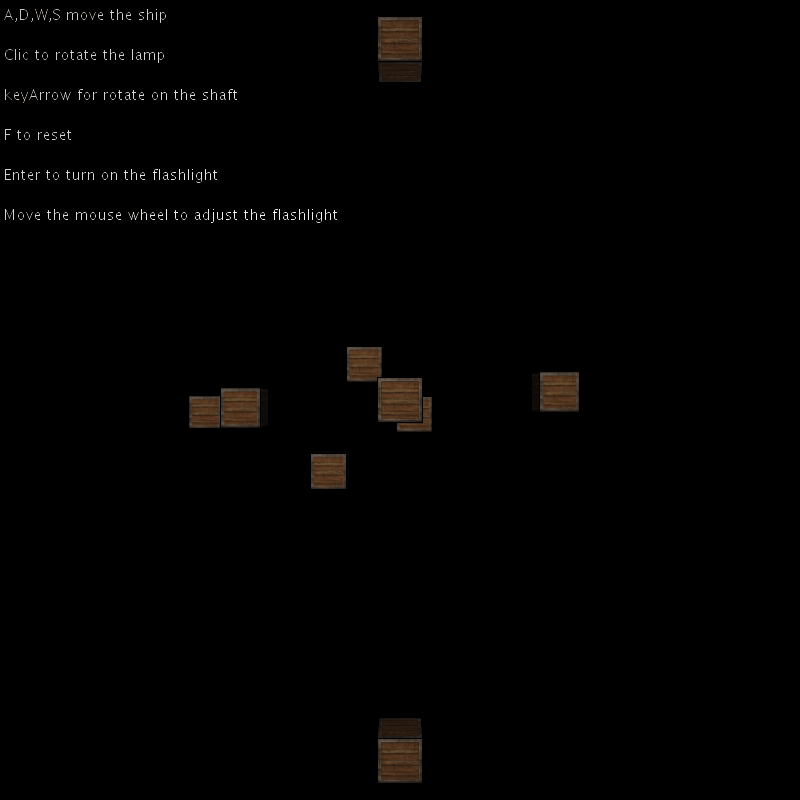
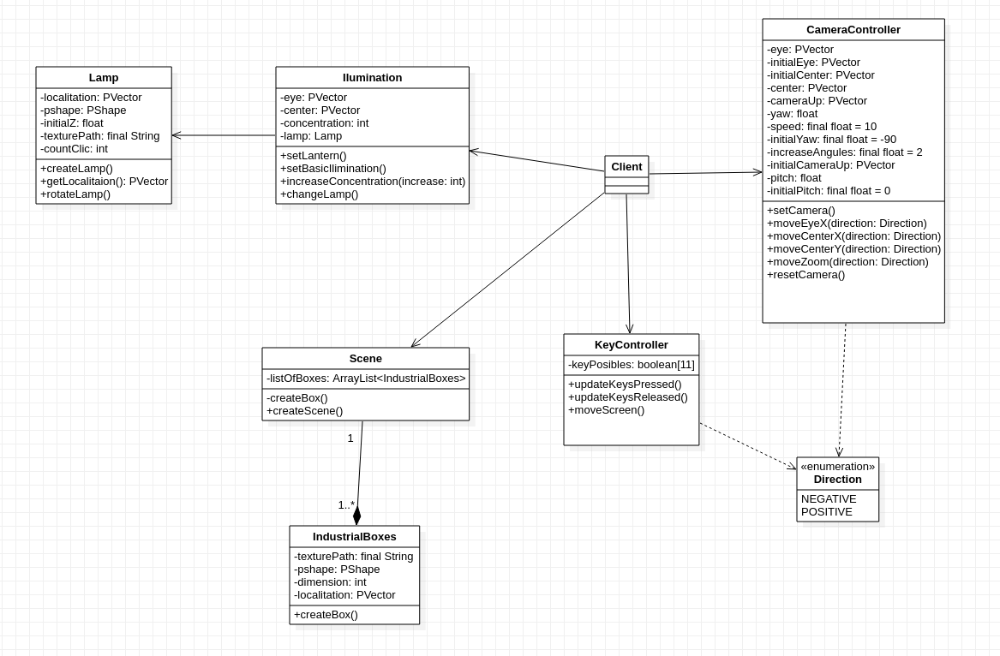

# Ilumination


## Autor
Miguel Ángel Medina Ramírez <br>
Correo: miguel.medina108@alu.ulpgc.es

## Índice
1. [Introducción](#introducción)
2. [Demostración](#demostración)
3. [Dependencias](#dependencias)
4. [Implementación](#implementación)<br>
 4.1. [Diseño de clases](#diseño-de-clases)<br>
 4.2. [Iluminación](#iluminación)<br>
 4.3. [Modelo de camara](#modelo-de-camara)<br>
    &nbsp;4.3.1. [Movimiento](#movimiento)<br>
    &nbsp;4.3.2. [Rotaciones](#rotaciones)<br>
    &nbsp;4.3.3. [Ángulo de Euler](#ángulos-de-euler)<br>
5. [Eventos y Controles](#eventos-y-controles)
6. [Bibliografía](#bibliografía)

## Introducción
El objetivo de esta práctica es componer una escena con objetos 3D, texturas,una cámara y una iluminación acorde. Para cumplir los objetivos se ha optado por componer una escena sencilla y jugar con los tipos de luces que nos ofrece processing. Aparte el sistema de cámara es igual al de la práctica anterior a excepción de que no se puede rotar la camara sobre el ángulo *roll*.

La escena que se ha creado es sencilla se trata de un sistemas de cajas iluminadas por una fuente de luz que simula ser una lámpara, esta fuente se puede rotar por el sistema de cajas para ver el efecto de una luz en un punto dado, además se han usado diversas primitivas de luces para tener la sensación de una vez se apague esa fuente de luz disponer de una linterna donde su origen será la propia cámara.

## Demostración
<p align="center"> 
   </img>
   <p align="center">Figura 1: Gif de demostración</p>
</p>

## Dependencias
Para poder ejecutar y probar la práctica solamente se necesita clonar este repositorio y el editor de processing con la siguiente dependencia:
- La librería **GifAnimation** para poder reproducir y guardar gifs. Como esta librería no forma parte necesaria para la correcta implementación de la práctica, en el código toda la lógica relacionada con ella se encuentra comentada, además de que afecta al rendimiento de la aplicación.En este [enlace](https://github.com/extrapixel/gif-animation) se encuentra la forma de instalarla.

## Implementación
Se ha optado por un diseño de clases sencillo.

### Diseño de clases
<p align="center"> 
   </img>
   <p align="center">Figura 2: Diagrama de clases</p>
</p>

### Iluminación


### Modelo de camara
El modelo que se busca es tener una cámara en **primera persona**, para ello el método *camera* nos ofrece tres puntos para controlar:
 
 * **eye**: Coordenadas para controlar la posición del ojo con respecto al sistema observable.
 * **center**: Coordenadas que representan al observador.
 * **up**: El vector vertical se usa para inducir un ángulo de inclinación a la camara.
 
Para tener un modelo de primera persona lo que se pretende es que el punto observable se mueva cada vez que se mueva el ojo  teniendo un efecto de movimiento continuo lo más natural posible.Por tanto, es necesario definir tres vectores para cada una de las componentes y operar con ellas según lo que el usuario quiera hacer.


#### Movimiento
La idea de tener una cámara en primera persona es para disponer de un cámara totalmente liberada y con un movimiento fluido para ello se han de modificar el vector *eye* según una serie de operaciones y una determinada velocidad:

 1. Si se quiere ir hacia delante o hacia atrás:
 ```java
    PVector aux = new PVector(center.x*speed, center.y*speed, center.z*speed);
    if(direction == Direction.NEGATIVE) {
      eye.x += aux.x;
      eye.y += aux.y;
      eye.z += aux.z;
    } else {
      eye.x -= aux.x;
      eye.y -= aux.y;
      eye.z -= aux.z;
    }
 ```
 
 2. Si se quiere ir hacia los laterales:
 ```java
    PVector aux = center.cross(cameraUp).normalize().mult(speed);
    if(direction == Direction.NEGATIVE) {
      eye.x += aux.x;
      eye.y += aux.y;
      eye.z += aux.z;
    } else {
      eye.x -= aux.x;
      eye.y -= aux.y;
      eye.z -= aux.z;
    }
 ```

#### Rotaciones
Para mirar alrededor de la escena, tenemos que cambiar el vector *center*. Sin embargo, cambiar el vector de dirección basado en las rotaciones es un poco complicado y requiere algo de trigonometría.

#### Ángulos de Euler
Los ángulos de Euler son 3 valores que pueden representar cualquier rotación en 3D. Existen 3 ángulos de Euler: *pitch*, *yaw* y *roll* . La siguiente imagen les da un significado visual:
 
<p align="center"> 
   </img>
   <p align="center">Figura 3: Ángulos de Euler</p>
</p>
 
*Pitch* es el ángulo que representa cuánto estamos mirando hacia arriba o hacia abajo. El *yaw* representa cuánto estamos mirando hacia la izquierda o hacia la derecha. El *roll* resenta el ángulo de giro.
 
Cada uno de los ángulos de Euler está representado por un solo valor y con la combinación de los 3 podemos calcular cualquier vector de rotación en 3D, modificando los ángulos según nuestras necesidades podemos implementar un modelo de cámara que rote sobre sí misma, se limita el angulo *pitch* para que solo se puede mirar hacia arriba o hacia abajo como máximo:


```java
  private void updateDirectorVector(){
    center.x = cos(radians(yaw)) * cos(radians(pitch));
    center.y = sin(radians(pitch));
    center.z = sin(radians(yaw)) * cos(radians(pitch));
    center.normalize();
  }
  
  public void moveCenterX(Direction direction){
    if(direction == Direction.NEGATIVE){
      yaw += increaseAngules;
    } else {
      yaw -= increaseAngules;
    }
    if(abs(yaw) >= 360) yaw = 0;
    updateDirectorVector();
  }
  
  public void moveCenterY(Direction direction){
    if(direction == Direction.NEGATIVE){
      pitch += increaseAngules;
    } else {
      pitch -= increaseAngules;
    }
    if (pitch >= 89) pitch = 89;
    if (pitch <= -89) pitch = -89;
    updateDirectorVector();
  }
```

## Eventos y Controles

<table class="table" style="width:100%">
  <tr>
    <th>Tecla</th>
    <th>Uso</th>
  </tr>
  <tr>
    <td>w</td>
    <td>Mueve la cámara hacia delante</td>
  </tr>
  <tr>
    <td>s</td>
    <td>Mueve la cámara hacia atrás</td>
  </tr>
  <tr>
    <td>a</td>
    <td>Mueve la cámara hacia izquierda</td>
  </tr>
  <tr>
    <td>d</td>
    <td>Mueve la cámara hacia derecha</td>
  </tr>
  <tr>
    <td>f</td>
    <td>Resetea la posición de la cámara</td>
  </tr>
  <tr>
    <td>Flechas del teclado</td>
    <td>Mover el ángulo de visión de la cámara</td>
  </tr>
  <tr>
    <td>Enter</td>
    <td>Para encender la linterna</td>
  </tr>
  <tr>
    <td>Clic derecho para rotar la lampara</td>
    <td>Para encender la linterna</td>
  </tr>
</table>


## Bibliografía

* [Guion de prácticas](https://cv-aep.ulpgc.es/cv/ulpgctp20/pluginfile.php/126724/mod_resource/content/22/CIU_Pr_cticas.pdf)
* [processing.org](https://processing.org/)
* [Iluminación OpenGL](https://learnopengl.com/Lighting/Lighting-maps)